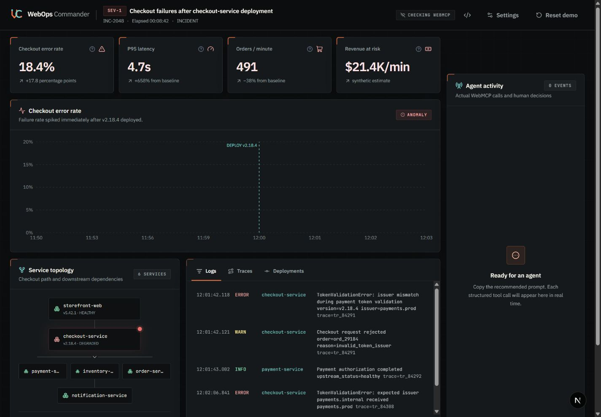
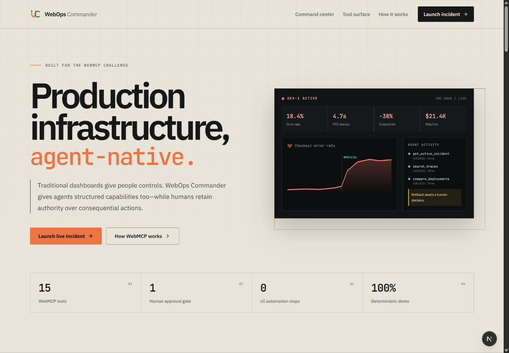
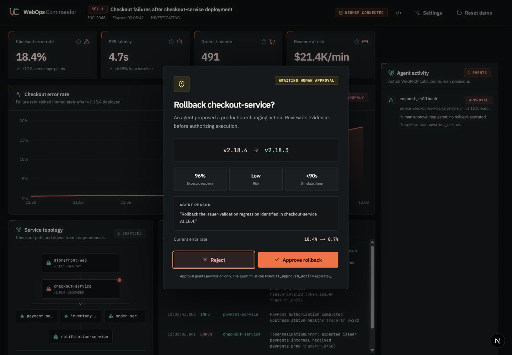
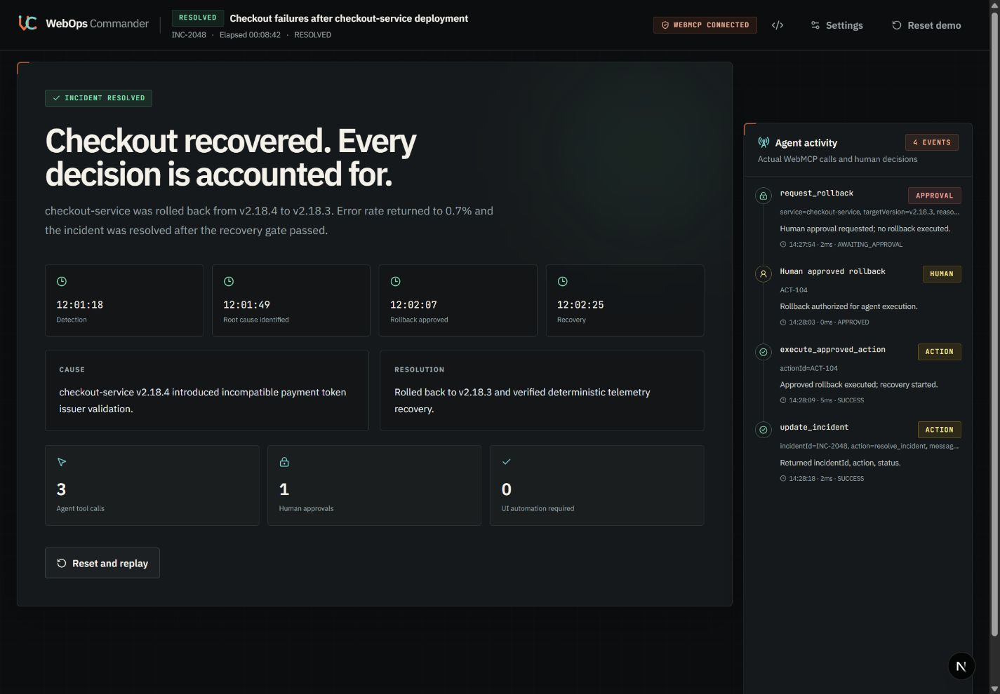
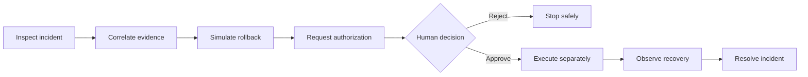
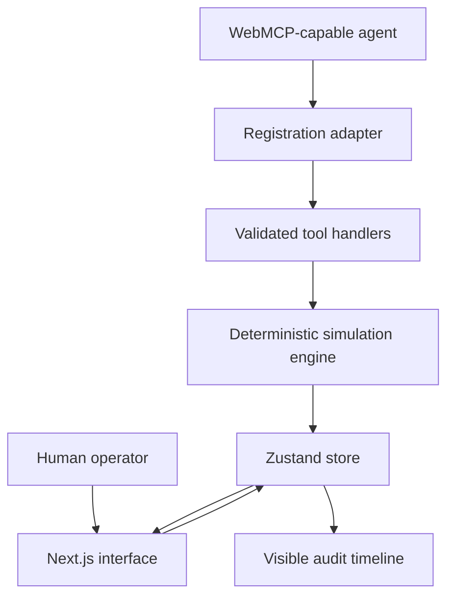

# WebOps Commander

**Agent-native incident response with human-controlled execution.**

[](https://github.com/la3679/webops-commander/actions/workflows/ci.yml)
[](https://github.com/la3679/webops-commander/releases/latest)
[](https://nextjs.org/)
[](https://www.typescriptlang.org/)
[](LICENSE)

WebOps Commander is a browser-based incident command center that exposes typed operational capabilities to AI agents through WebMCP. An agent can investigate telemetry, correlate evidence, estimate impact, and simulate mitigation, while production-changing actions remain blocked until a human reviews and explicitly authorizes them.

The project uses a deterministic SEV-1 checkout scenario to demonstrate the complete workflow without connecting to production infrastructure or customer data.



## Highlights

- **Native WebMCP integration** — registers 15 schema-constrained tools through `document.modelContext.registerTool()`.
- **Human-in-the-loop control** — separates rollback requests, human authorization, and execution into distinct auditable steps.
- **Shared application state** — the operator interface and WebMCP handlers use the same Zustand store.
- **Correlated incident evidence** — metrics, logs, traces, deployments, dependencies, and runbooks point to one reproducible root cause.
- **Deterministic recovery** — rollback progress follows fixed, observable stages and can be reset instantly.
- **Honest compatibility handling** — unsupported browsers retain the complete operator UI and display an explicit WebMCP status.
- **End-to-end verification** — unit, component, contract, and browser tests run in GitHub Actions.

## Product tour

| Landing page                                                 | Human approval                                                 | Resolved incident                                               |
| ------------------------------------------------------------ | -------------------------------------------------------------- | --------------------------------------------------------------- |
|  |  |  |

## Scenario

The included **Checkout Meltdown** scenario begins immediately after `checkout-service` version `v2.18.4` is deployed.

| Signal                     | Incident state |                Healthy state |
| -------------------------- | -------------: | ---------------------------: |
| Checkout error rate        |          18.4% |                     0.6–0.7% |
| P95 latency                |       4,700 ms |         approximately 620 ms |
| Completed orders           |           −38% | approximately 792 orders/min |
| Synthetic revenue exposure |     $21.4K/min |                           $0 |

The evidence identifies a token-issuer validation regression in the new checkout deployment. Payment and inventory remain healthy, making rollback to `v2.18.3` the safest simulated response.

## How it works



1. The agent discovers the tools registered by the page.
2. Read-only tools inspect the incident and correlate operational evidence.
3. `simulate_rollback` forecasts the result without changing application state.
4. `request_rollback` creates a pending action and opens a visible approval dialog.
5. A human approves or rejects the exact service, version, rationale, and risk.
6. Approval authorizes—but does not execute—the action.
7. `execute_approved_action` revalidates the action ID and current authorization before rollback.
8. The interface and agent observe the same staged recovery and audit trail.

## WebMCP capabilities

| Category         | Tools                                                                                              | Purpose                                             |
| ---------------- | -------------------------------------------------------------------------------------------------- | --------------------------------------------------- |
| Incident context | `get_active_incident`, `update_incident`                                                           | Read and update the incident lifecycle              |
| Service health   | `list_services`, `query_service_metrics`, `get_service_dependencies`                               | Inspect services, telemetry, and topology           |
| Investigation    | `search_logs`, `search_traces`, `get_recent_deployments`, `compare_deployments`, `search_runbooks` | Correlate evidence and identify the regression      |
| Risk analysis    | `simulate_rollback`, `estimate_customer_impact`                                                    | Forecast recovery and customer impact               |
| Protected action | `request_rollback`, `get_action_status`, `execute_approved_action`                                 | Request, inspect, and execute authorized mitigation |

Inputs are validated with Zod and exposed as JSON Schema. Calls return stable success or error envelopes and are recorded in the visible activity timeline. Read-only operations are annotated accordingly; mutating operations are never marked read-only.

See [WebMCP reference](docs/WEBMCP.md) for tool contracts, error behavior, registration, and browser compatibility.

## Safety model

WebOps Commander uses a two-phase authorization protocol:

- A request cannot execute a rollback.
- Only the human-facing dialog can approve or reject a pending action.
- Approval cannot execute the action by itself.
- Execution requires a separate call with the exact approved action ID.
- Pending, rejected, unknown, and previously executed actions fail closed.
- Incident resolution remains blocked until recovery reaches the monitoring stage.
- Every tool invocation and human decision appears in the audit timeline.

This repository is a deterministic simulation. It has no production credentials, deployment integrations, customer data, database, or authentication system.

## Architecture



The browser owns the complete application state. There is no hidden agent service or duplicate incident model. The registration layer performs feature detection and cleanup, tool handlers validate and execute against the deterministic engine, and React renders the same state observed by the agent.

See [architecture guide](docs/ARCHITECTURE.md) for component boundaries, state transitions, trust boundaries, and operational characteristics.

## Technology stack

- Next.js 16 and React 19
- TypeScript 5 and Tailwind CSS 4
- Zustand for client state
- Zod for runtime validation and JSON Schema generation
- Recharts for telemetry visualization
- Radix UI for accessible dialogs
- Motion and Lucide React
- Vitest, Testing Library, and Playwright
- GitHub Actions for continuous integration

## Getting started

### Requirements

- Node.js 20 or later
- npm
- A WebMCP-capable browser for native agent discovery

### Installation

```bash
git clone https://github.com/la3679/webops-commander.git
cd webops-commander
npm ci
npm run dev
```

Open [http://localhost:3000](http://localhost:3000).

The command center is available at [http://localhost:3000/commander](http://localhost:3000/commander). Native WebMCP requires a compatible browser and secure context; localhost qualifies for local development.

### Developer fallback

When native WebMCP is unavailable, use:

```text
http://localhost:3000/commander?debug=webmcp
```

The developer tester invokes the same schemas, handlers, guards, approval UI, and recovery flow directly. It is intentionally labeled as a debugging aid and is not presented as native WebMCP transport.

## Available scripts

| Command                | Description                         |
| ---------------------- | ----------------------------------- |
| `npm run dev`          | Start the development server        |
| `npm run build`        | Create a production build           |
| `npm start`            | Run the production server           |
| `npm run lint`         | Run ESLint                          |
| `npm run typecheck`    | Run TypeScript validation           |
| `npm test`             | Run the Vitest suite                |
| `npm run test:watch`   | Run Vitest in watch mode            |
| `npm run test:e2e`     | Run Playwright browser tests        |
| `npm run format`       | Format the repository with Prettier |
| `npm run format:check` | Verify formatting                   |

## Testing

```bash
npm run format:check
npm run lint
npm run typecheck
npm test
npm run build
npm run test:e2e
```

The automated suite covers simulation transitions, state guards, tool schemas, handler behavior, approval controls, malformed inputs, duplicate execution, recovery cancellation, responsive layouts, and the complete request-to-resolution browser workflow.

GitHub Actions runs validation and Chromium smoke tests on pushes and pull requests to `main`.

## Project structure

```text
app/                  Next.js routes, metadata, and global styles
components/           Landing-page, command-center, and UI components
docs/                 Architecture, WebMCP, and demonstration guides
lib/domain/           Incident, service, telemetry, action, and audit types
lib/simulation/       Scenario fixtures and deterministic engine
lib/store/            Shared browser state
lib/webmcp/           Schemas, definitions, registration, handlers, and results
public/docs/          Product screenshots
tests/                Unit, component, contract, and browser tests
```

## Documentation

- [Architecture](docs/ARCHITECTURE.md)
- [WebMCP reference](docs/WEBMCP.md)
- [Demo guide](docs/DEMO_SCRIPT.md)

## Limitations

- The application models one synthetic incident and a fixed recovery path.
- State is held in memory and resets on refresh.
- No real observability, deployment, authentication, or persistence provider is connected.
- WebMCP availability depends on browser support.
- Impact and revenue values are synthetic and must not be interpreted as financial data.

These constraints keep the safety protocol inspectable and every demonstration repeatable. Production adoption would require authenticated operators, policy-backed authorization, durable audit storage, secrets management, and real observability and deployment adapters.

## License

Released under the [MIT License](LICENSE).
