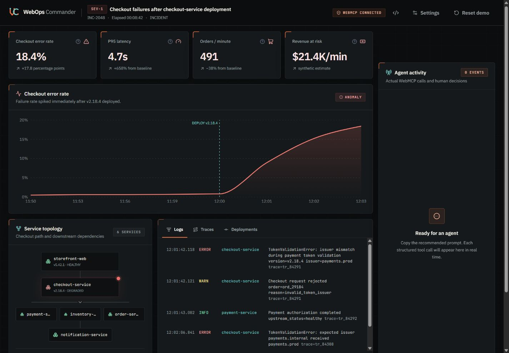
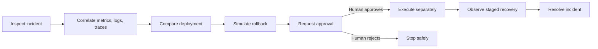
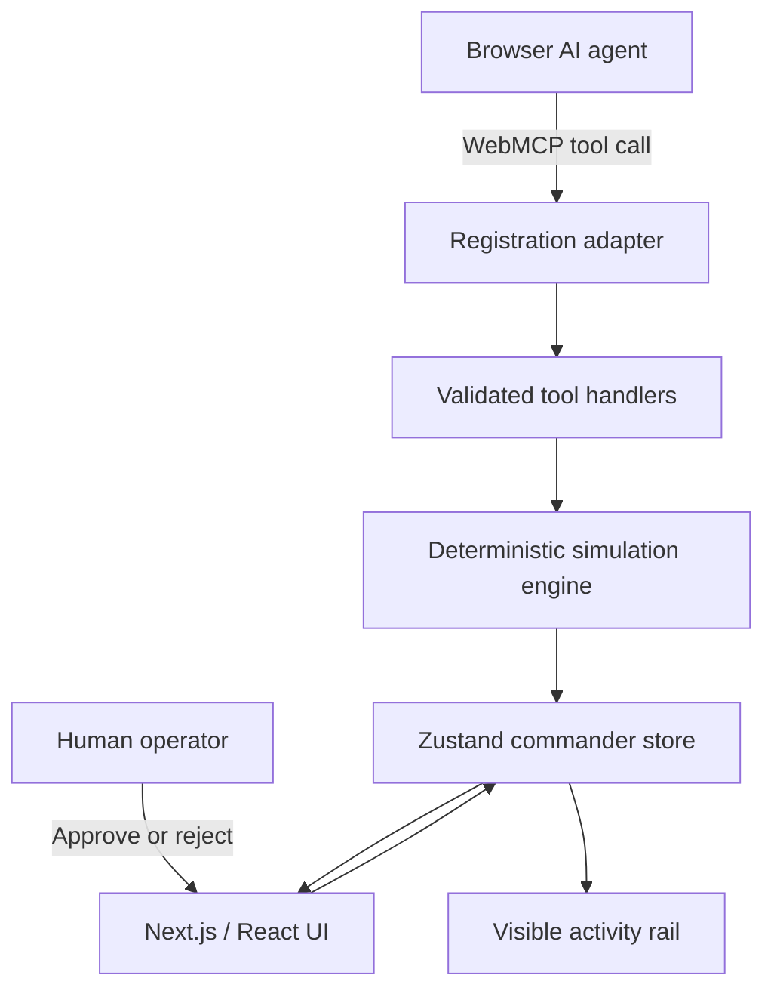

# WebOps Commander

**Agent-native incident response, with humans in command.**

[](https://github.com/la3679/webops-commander/actions/workflows/ci.yml)

[](LICENSE)

WebOps Commander is a deterministic incident-response command center that demonstrates a browser application exposing its own operational capabilities to an AI agent through the WebMCP imperative API. The agent can investigate deeply, correlate evidence, estimate impact, and simulate mitigation, but a production-changing rollback remains impossible until a human explicitly authorizes the visible request.

The UI, WebMCP handlers, simulation engine, audit history, and approval state all share one browser-owned source of truth. There is no hidden agent service or second incident model drifting away from what the operator sees.



## What the application includes

The landing page is a complete product explainer rather than a decorative splash screen. It documents:

- every command-center surface;
- all 15 WebMCP tools, grouped by operational purpose;
- the full inspect → correlate → simulate → approve → execute → recover → resolve lifecycle;
- the two-phase human authorization protocol;
- deterministic recovery stages;
- the browser-owned architecture and technology stack;
- compatibility requirements and deliberate demo constraints.

The command center brings the complete incident into one workspace:

- four live KPIs for checkout error rate, p95 latency, orders per minute, and synthetic revenue exposure;
- an animated error-rate chart with deployment and rollback markers;
- a six-service topology with health, versions, dependencies, and highlighted query paths;
- searchable synthetic logs, distributed traces, and deployment history;
- a real-time activity rail sourced from actual handler and operator events;
- visible WebMCP availability, settings, reset controls, and a clearly labeled developer tester;
- explicit approval, rejection, guarded execution, staged recovery, and resolved states.

## The Checkout Meltdown scenario

A SEV-1 incident begins immediately after `checkout-service` version `v2.18.4` is deployed:

| Signal                     |  Incident value | Healthy context        |
| -------------------------- | --------------: | ---------------------- |
| Checkout error rate        |       **18.4%** | 0.6–0.7% baseline      |
| P95 latency                | **4.7 seconds** | approximately 620 ms   |
| Completed orders           |        **−38%** | about 792 orders/min   |
| Synthetic revenue exposure |  **$21.4K/min** | no real financial data |

The fixtures intentionally correlate. Logs report a token issuer mismatch, a failing trace localizes the new `validatePaymentToken` path, the deployment history shows stricter validation in `v2.18.4`, and payment plus inventory remain healthy. The safe response is a simulated rollback to `v2.18.3`, explicit human authorization, separate execution, observed recovery, and final resolution.

## End-to-end response lifecycle



Recovery is deliberately observable rather than instantaneous:

| Stage           | Error rate | P95 latency |
| --------------- | ---------: | ----------: |
| Incident        |      18.4% |    4,700 ms |
| Rollback begins |      12.7% |    3,100 ms |
| Traffic shifts  |       7.1% |    1,800 ms |
| Stabilizing     |       2.2% |      890 ms |
| Monitoring      |       0.7% |      630 ms |

Resolution stays blocked until recovery reaches the monitoring stage.

## WebMCP tool surface

On a compatible secure browser, the application registers 15 schema-constrained tools with `document.modelContext.registerTool()`:

| Category         | Tools                                                                                              | Purpose                                                                                    |
| ---------------- | -------------------------------------------------------------------------------------------------- | ------------------------------------------------------------------------------------------ |
| Incident context | `get_active_incident`, `update_incident`                                                           | Read severity, impact, lifecycle, and hypothesis; add status or resolve after recovery     |
| Service health   | `list_services`, `query_service_metrics`, `get_service_dependencies`                               | Inspect health, versions, traffic, telemetry, and topology                                 |
| Investigation    | `search_logs`, `search_traces`, `get_recent_deployments`, `compare_deployments`, `search_runbooks` | Correlate evidence, identify the regression, and retrieve the response procedure           |
| Risk analysis    | `simulate_rollback`, `estimate_customer_impact`                                                    | Forecast recovery, confidence, risk, affected users, failed orders, and exposure           |
| Guarded action   | `request_rollback`, `get_action_status`, `execute_approved_action`                                 | Request visible authorization, inspect the decision, and execute the exact approved action |

Calls are runtime-validated with Zod-generated JSON Schema. Read-only tools carry `readOnlyHint: true`; mutating tools do not. Every invocation records its tool name, category, summarized input, status, deterministic duration, timestamp, and result summary in the visible activity rail.

### Registration and cleanup

On mount, the command center feature-detects the current imperative WebMCP API and registers every tool:

```ts
await document.modelContext.registerTool(
  {
    name,
    title,
    description,
    inputSchema,
    annotations: { readOnlyHint, untrustedContentHint: false },
    execute: (input) => executeWebMcpTool(name, input),
  },
  { signal: controller.signal },
);
```

The `AbortSignal` removes registrations when the command center unmounts. `@mcp-b/webmcp-types` supplies compile-time DOM types; it is not a runtime polyfill. The app does not invent a `navigator` API, inject a fake bridge, or substitute DOM scraping for WebMCP.

When `document.modelContext` is absent, the header reports that WebMCP is unavailable and the dashboard remains fully usable. The optional `?debug=webmcp` tester calls the same handlers directly and is visibly labeled as a developer fallback rather than native transport.

### Shared result contract

Zod is the source of truth for strict input validation and is converted to JSON Schema for registration. Known services are `storefront-web`, `checkout-service`, `payment-service`, `inventory-service`, `order-service`, and `notification-service`. Supported time ranges are `15m`, `30m`, and `1h`.

Successful calls return:

```json
{
  "ok": true,
  "data": {},
  "meta": {
    "synthetic": true,
    "source": "WebOps Commander deterministic simulator"
  }
}
```

Failures return:

```json
{
  "ok": false,
  "error": {
    "code": "STABLE_ERROR_CODE",
    "message": "Actionable explanation",
    "details": {}
  }
}
```

### Detailed tool contracts

#### Incident and service context

| Tool                       | Input                                                                                                                  | Output                                                                          | Mutation / approval                        | Specific errors                    |
| -------------------------- | ---------------------------------------------------------------------------------------------------------------------- | ------------------------------------------------------------------------------- | ------------------------------------------ | ---------------------------------- |
| `get_active_incident`      | `{}`                                                                                                                   | Incident ID, severity, status, impact, exposure, hypothesis, and timestamps     | No; read-only                              | `INVALID_INPUT`                    |
| `list_services`            | `{}`                                                                                                                   | Six services with health, version, traffic, error rate, and p95 latency         | No; read-only                              | `INVALID_INPUT`                    |
| `query_service_metrics`    | `{ service, metric, timeRange }`; metric is `error_rate`, `p95_latency`, `requests_per_minute`, or `orders_per_minute` | Deterministic timestamp/value series and units                                  | No; read-only                              | `INVALID_INPUT`, `UNKNOWN_SERVICE` |
| `get_service_dependencies` | `{ service }`                                                                                                          | Upstream/downstream graph; also highlights the visible topology path            | UI selection only; operationally read-only | `INVALID_INPUT`                    |
| `estimate_customer_impact` | optional `{ incidentId: "INC-2048" }`                                                                                  | Synthetic attempts, affected customers, failed orders, exposure, and confidence | No; read-only                              | `INVALID_INPUT`                    |

#### Investigation evidence

| Tool                     | Input                                                         | Output                                                       | Mutation / approval | Specific errors                         |
| ------------------------ | ------------------------------------------------------------- | ------------------------------------------------------------ | ------------------- | --------------------------------------- |
| `search_logs`            | optional `service`, `severity`, `keyword`, and `timeRange`    | Matching structured logs with timestamps and correlation IDs | No; read-only       | `INVALID_INPUT`                         |
| `search_traces`          | optional `service`, `status`, or `correlationId` (`tr_#####`) | Trace summaries and ordered spans with duration and status   | No; read-only       | `INVALID_INPUT`                         |
| `get_recent_deployments` | `{ timeRange, service? }`                                     | Deployments, versions, timestamps, status, and summary       | No; read-only       | `INVALID_INPUT`                         |
| `compare_deployments`    | `{ service, fromVersion, toVersion }`                         | Relevant code/config delta and incident correlation          | No; read-only       | `INVALID_INPUT`, `DEPLOYMENT_NOT_FOUND` |
| `search_runbooks`        | `{ query }` from 2–120 characters                             | Ranked runbooks and ordered response steps                   | No; read-only       | `INVALID_INPUT`                         |

#### Simulation and protected action

| Tool                      | Input                                                                                              | Output                                                                                | Mutation / approval                            | Specific errors                                                                       |
| ------------------------- | -------------------------------------------------------------------------------------------------- | ------------------------------------------------------------------------------------- | ---------------------------------------------- | ------------------------------------------------------------------------------------- |
| `simulate_rollback`       | `{ service, targetVersion }`                                                                       | Predicted error/latency recovery, confidence, risk, duration, and affected dependency | No; read-only simulation                       | `INVALID_INPUT`, `UNSUPPORTED_ROLLBACK`                                               |
| `request_rollback`        | `{ service, targetVersion, reason }`; reason is 20–500 characters                                  | `ACT-104`, `AWAITING_HUMAN_APPROVAL`, and explicit next-step guidance                 | Creates a pending request only; never executes | `INVALID_INPUT`, `UNSUPPORTED_ROLLBACK`, state conflict                               |
| `get_action_status`       | `{ actionId }` matching `ACT-###`                                                                  | Status, target, decision timestamp, and execution timestamp                           | No; read-only                                  | `INVALID_INPUT`, `ACTION_NOT_FOUND`                                                   |
| `execute_approved_action` | `{ actionId }`                                                                                     | Execution acknowledgement, rollback version, and monitoring guidance                  | Yes; only after matching human approval        | `INVALID_INPUT`, `ACTION_NOT_FOUND`, `ACTION_NOT_APPROVED`, `ACTION_ALREADY_EXECUTED` |
| `update_incident`         | `{ incidentId: "INC-2048", action, message }`; action is `add_status_update` or `resolve_incident` | Updated lifecycle/status acknowledgement                                              | Yes; resolution requires recovered state       | `INVALID_INPUT`, `RECOVERY_NOT_COMPLETE`                                              |

Every tool may also return `TOOL_EXECUTION_FAILED` for an unexpected handler exception. Mutating tools use `readOnlyHint: false`; all others use `readOnlyHint: true`. The deterministic fixtures are application-authored, so registrations use `untrustedContentHint: false`.

## Human authorization is enforced

Rollback uses a two-phase protocol:

1. `simulate_rollback` predicts impact without changing state.
2. `request_rollback` creates visible action `ACT-104` in `PENDING`.
3. The approval dialog shows the target, rationale, risk, expected recovery, and current impact.
4. Only the human-facing **Approve rollback** or **Reject** controls can decide the request.
5. Approval changes the action to `APPROVED`; it still does not execute anything.
6. The agent must separately call `execute_approved_action({ actionId: "ACT-104" })`.
7. The handler re-checks the exact ID and current authorization immediately before rollback.

Pending, rejected, unknown, and already-executed actions fail closed. Invalid service/version inputs and premature incident resolution return stable structured errors. The human decision is recorded alongside agent events in the same audit history.

## Architecture



The WebMCP boundary is intentionally thin. The registration adapter owns feature detection and cleanup. Framework-independent handlers validate input and call the deterministic engine through a Zustand-owned state adapter. React renders that same store, so the agent and human always observe the same incident.

### Technology

- Next.js 16, React 19, TypeScript, and Tailwind CSS;
- Zustand for shared client-side domain state;
- Zod and generated JSON Schema for tool contracts;
- Recharts for incident telemetry;
- Radix Dialog for accessible approval and settings flows;
- Lucide for interface iconography plus a custom WebOps Commander routing-path mark;
- Vitest, Testing Library, Playwright, and GitHub Actions for verification.

### Architecture layers

- **Domain and scenario:** `lib/domain` defines incidents, services, metrics, logs, traces, deployments, runbooks, actions, lifecycle states, and audit events. `lib/simulation/scenario.ts` holds the immutable, intentionally correlated `INC-2048` fixtures.
- **Deterministic engine:** `lib/simulation/engine.ts` implements pure queries and guarded transitions independently from React and WebMCP.
- **Client state:** `lib/store/use-commander-store.ts` owns the incident, services, pending action, recovery stage, selected evidence, WebMCP availability, and audit timeline. Store actions enforce lifecycle rules even outside visual controls.
- **WebMCP boundary:** schemas define names and Zod contracts; definitions add descriptions, category, metadata, and JSON Schema; handlers validate calls and produce structured results; registration feature-detects `document.modelContext` and cleans up with an `AbortSignal`.
- **Presentation:** Next.js renders the educational landing page and `/commander`; stable selectors keep the dashboard hierarchy responsive without duplicating domain state.

### Trust boundaries

- Every tool input is runtime-validated.
- Unknown services, metrics, versions, ranges, and action IDs return stable error codes.
- Mutating tools are never marked read-only.
- UI controls and tool calls pass through the same guarded transitions.
- The audit rail records category, status, duration, summarized input, and result.
- The scenario is synthetic and no production system is contacted.

### Operational characteristics

- **Persistence:** in-memory by design. Refresh or Reset Demo restores the known initial state.
- **Timer safety:** reset cancels every scheduled recovery stage before replacing state, preventing delayed mutations after a mid-recovery reset.
- **Network:** no runtime data requests after application assets load.
- **Authentication:** none because the scenario contains no real system or customer data.
- **Fallback:** the dashboard remains usable and reports unavailable when native WebMCP is absent.
- **Failure behavior:** invalid or unauthorized transitions return typed errors without mutation.

## Visual system and accessibility

The current interface uses a custom industrial operations identity:

- a warm paper-like editorial landing page and graphite command center;
- signal orange for action, telemetry cyan for agent/system context, and semantic red/amber/green states;
- IBM Plex Sans for interface text and JetBrains Mono for telemetry and identifiers;
- a bespoke `WC` routing-path logo instead of generic AI sparkles, bots, or neural-network imagery;
- 44px minimum controls, visible focus treatment, semantic labels, keyboard-operable dialogs, and reduced-motion support;
- responsive layouts verified at 375, 768, 1024, and 1440 pixels without page-level horizontal overflow.

The repository also includes the complete visual source of truth under `design-system/webops-commander/MASTER.md`, but the rules that affect the product are summarized here so this README remains self-contained.

## Under-three-minute demo walkthrough

Target runtime: **2 minutes 40 seconds**. Start on the landing page in a WebMCP-capable browser with its agent panel visible.

### 0:00–0:20 — Frame the product

Explain that operational dashboards were designed for people to click through. WebOps Commander makes the website itself legible and actionable to an AI agent through native WebMCP while preserving human control over production-changing decisions. Point out the 15 native tools, one approval gate, zero UI-automation steps, and deterministic demo. Enter the command center.

### 0:20–0:40 — Establish the incident

Show the SEV-1 header, four KPIs, error chart, degraded checkout node, evidence tabs, and empty activity rail. State that errors reached 18.4%, latency reached 4.7 seconds, orders fell 38%, and synthetic exposure reached $21.4K per minute immediately after deployment.

### 0:40–1:20 — Let the agent investigate

Send this prompt:

> Investigate the active checkout incident. Use the available WebMCP tools to identify the root cause and recommend the safest mitigation. You may inspect anything necessary, but do not execute production-changing actions without my approval.

The agent discovers typed tools directly from the page, then reads the incident, metrics, logs, traces, topology, deployments, and runbook. It should correlate the `v2.18.4` issuer-validation change with failed checkout traces while payment and inventory remain healthy. When it simulates rollback, emphasize that prediction does not change state.

### 1:20–1:55 — Prove the safety boundary

Ask the agent to request rollback. The request creates `ACT-104` and executes nothing. The human-facing dialog shows the exact service, source and target versions, rationale, predicted recovery, and risk. Optionally attempt execution first to demonstrate `ACTION_NOT_APPROVED`.

Approve the rollback in the dialog, then explain that approval still does not execute—it authorizes a separate auditable call. Ask the agent to execute approved action `ACT-104` and monitor recovery.

### 1:55–2:25 — Observe recovery

Point to version `v2.18.3`, the rollback marker, changing KPIs, and audit trail. Errors fall from 18.4% to 0.7% and latency returns to 630 ms. The agent and operator observe the same state. Ask the agent to resolve only after monitoring is reached.

### 2:25–2:40 — Close and reset

Summarize the three proofs: a real browser-native tool surface, explicit human authorization, and a deterministic end-to-end incident story inside one application. Click **Reset demo** to restore the exact initial state.

### Backup path

If native WebMCP is unavailable, show the honest compatibility status and open `/commander?debug=webmcp`. The tester exercises the same schemas, handlers, guards, approval dialog, and recovery flow, but must be described as a developer aid rather than native transport.

## Project story

### Inspiration

During outages, responders stitch together dashboards, logs, traces, deployments, runbooks, and change controls. Agents can help investigate, but opaque or unrestricted production access creates a second risk during an already stressful event. The core question was: what if the incident console exposed a precise browser-native capability surface while consequential actions still required an explicit, visible human decision?

### What was difficult

The hardest part was making the agent experience genuinely native without hiding the safety model. Tool descriptions needed real operational meaning, outputs had to stay compact and deterministic, schemas needed stable error behavior, and chart animation, topology selection, approval, execution, recovery, audit entries, and responses all needed one source of truth.

### What the project accomplished

- a real 15-tool WebMCP surface registered by the page;
- a complete guarded incident lifecycle with explicit authorization;
- stable structured success and error envelopes;
- an activity rail generated by actual handler and human events rather than a fabricated transcript;
- responsive operator UI across desktop, tablet, phone, and landscape widths;
- a deterministic sub-three-minute story that can be reset instantly;
- automated coverage from pure engine transitions through the complete browser flow.

### What we learned

WebMCP changes a web interface from a picture an agent interprets into a provider of explicit capabilities. Trustworthy agent UX is not silent automation. It is shared state, legible intent, constrained contracts, visible authorization, enforceable transitions, and an audit trail that lets humans understand what happened.

### Future direction

Production observability and deployment adapters could replace the deterministic state adapter behind the existing contracts. A real deployment would add signed operator identities, policy-backed approval, role and environment constraints, durable/tamper-evident audit storage, secrets management, live telemetry adapters, and safe degraded behavior. Those additions belong behind the current human authorization protocol rather than replacing it.

## Run locally

Requires Node.js 20+ and npm.

```bash
git clone https://github.com/la3679/webops-commander.git
cd webops-commander
npm ci
npm run dev
```

Open [http://localhost:3000](http://localhost:3000). Native tool discovery requires a WebMCP-compatible browser in a secure context; localhost qualifies for local development. Browsers without WebMCP keep the complete operator interface and display an honest unavailable state.

For a deterministic walkthrough in any browser, open `http://localhost:3000/commander?debug=webmcp`. The developer tester invokes the same validated handlers directly and is explicitly labeled as a debugging fallback—not the native browser transport.

## Verification

```bash
npm run format:check
npm run lint
npm run typecheck
npm test
npm run build
npm run test:e2e
```

Current coverage includes:

- 21 passing Vitest tests across the simulation engine, state guards, WebMCP contracts, handlers, and approval UI;
- the Playwright landing-to-command-center smoke flow;
- the complete request → approve → execute → recover → resolve → reset lifecycle;
- phone and landscape operability with reduced motion;
- settings, developer fallback, malformed input feedback, and recovery cancellation;
- production compilation and static route generation.

GitHub Actions runs the same quality checks and Chromium browser coverage on pushes and pull requests.

## Repository map

```text
app/                  Next.js routes, metadata, icon, social image, and global styles
components/           brand, command-center, approval, settings, and UI primitives
design-system/        visual source of truth and delivery requirements
lib/domain/           incident, service, action, telemetry, and audit types
lib/simulation/       correlated fixtures and deterministic recovery engine
lib/store/            browser-owned source of truth
lib/webmcp/           schemas, definitions, registration, handlers, and results
public/docs/          verified product screenshots
tests/                unit, component, contract, and browser tests
docs/                 architecture, WebMCP, demo, and submission guides
```

## Deliberate constraints

WebOps Commander is a hackathon-sized browser simulation—not an observability backend or production deployment control plane. It contains one correlated incident, synthetic data, fixed recovery transitions, no authentication or database, and no connection to real infrastructure or customer data. Those boundaries keep the safety protocol inspectable and every demo run repeatable.

WebMCP is an evolving browser capability. Production adapters could later connect observability and deployment systems behind the existing contracts, with signed operator identities, policy approvals, and tamper-evident audit storage, without changing the human authorization protocol demonstrated here.

## License

[MIT](LICENSE) © 2026 WebOps Commander contributors.
