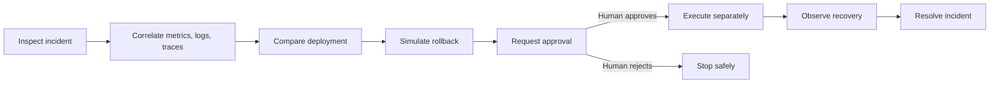
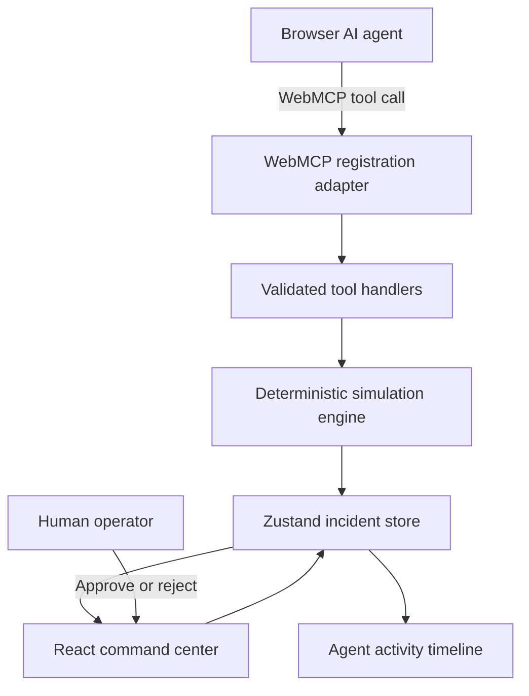

# WebOps Commander

**Agent-native incident response, with humans in command.**

[](https://github.com/la3679/webops-commander/actions/workflows/ci.yml)
[](docs/WEBMCP.md)
[](LICENSE)

WebOps Commander is a polished, deterministic incident-response command center built to show what happens when a website exposes operational capabilities directly to an AI agent through the WebMCP imperative API. The agent investigates deeply and simulates a safe mitigation, but cannot execute a production-changing rollback until a human explicitly approves the visible request.


## Why this exists

Operational dashboards are designed for people to click through, not for agents to understand. An agent usually has to infer meaning from pixels or depend on a separate integration that can drift away from the interface a human is watching. WebOps Commander demonstrates a different model: the same web application owns the UI, incident state, and a typed tool surface exposed to the browser's agent.

WebMCP is central—not a badge or mock transport. On a compatible secure browser, the application registers 15 tools with `document.modelContext.registerTool()`. Tool calls update the visible audit trail and act on the same deterministic domain state rendered by React.

## The scenario

A SEV-1 “Checkout Meltdown” begins immediately after `checkout-service` version `v2.18.4` is deployed:

- checkout errors climb to **18.4%**;
- p95 latency rises to **4.7 seconds**;
- orders fall **38%**;
- estimated revenue exposure reaches **$21.4K/min**;
- logs and traces isolate a new issuer-validation path while payment and inventory remain healthy.

The safe response is to simulate a rollback to `v2.18.3`, request human approval, execute only after approval, observe deterministic recovery, and resolve the incident.

## The agent workflow



Read-only investigation is unrestricted. `request_rollback` creates action `ACT-104` in a visible approval dialog but does not perform the rollback. A separate call to `execute_approved_action` is rejected unless that exact action is approved. Rejection, duplicate execution, invalid service/version, and premature resolution all return stable structured errors.

## WebMCP tool surface

| Category                 | Tools                                                                                              |
| ------------------------ | -------------------------------------------------------------------------------------------------- |
| Incident context         | `get_active_incident`, `update_incident`                                                           |
| Service health           | `list_services`, `query_service_metrics`, `get_service_dependencies`                               |
| Investigation            | `search_logs`, `search_traces`, `get_recent_deployments`, `compare_deployments`, `search_runbooks` |
| Risk analysis            | `simulate_rollback`, `estimate_customer_impact`                                                    |
| Human-in-the-loop action | `request_rollback`, `get_action_status`, `execute_approved_action`                                 |

See [WEBMCP.md](docs/WEBMCP.md) for schemas, outputs, errors, mutation behavior, approval requirements, feature detection, and registration details.

## Product highlights

- premium dark operations UI with a focused command-center hierarchy;
- responsive landing page and dashboard at desktop, tablet, and mobile widths;
- synchronized error-rate and latency visualization with deployment/rollback markers;
- interactive service topology, KPI cards with hover/focus explanations, logs, traces, and deployment history;
- visible WebMCP availability and a real-time agent activity/audit timeline;
- explicit approval, rejection, guarded execution, staged recovery, resolution, and a confirmed one-click reset that cancels in-flight recovery timers;
- a focused Settings panel for demo controls and WebMCP status;
- a spacious, responsive developer tester—available from Settings or `?debug=webmcp`—that invokes the same handlers and is clearly labeled as a developer aid, not the browser WebMCP transport;
- deterministic data and state transitions for a reliable hackathon demo.

## Architecture



The WebMCP boundary is intentionally thin. Zod schemas are converted to JSON Schema for registration and validate calls at runtime. Framework-independent handlers call a deterministic engine through a Zustand-owned state adapter. The UI and agent therefore observe one source of truth. Read the full [architecture guide](docs/ARCHITECTURE.md).

## Run locally

Requires Node.js 20+ and npm.

```bash
git clone https://github.com/la3679/webops-commander.git
cd webops-commander
npm ci
npm run dev
```

Open [http://localhost:3000](http://localhost:3000), enter the command center, and use a WebMCP-capable browser on a secure context for native agent tool discovery. The UI remains fully usable in browsers without WebMCP and explains that the tool surface is unavailable.

For a deterministic developer walkthrough in any browser, open `http://localhost:3000/commander?debug=webmcp`. This panel calls production handlers directly for testing; it is not represented as native WebMCP.

## Quality commands

```bash
npm run format:check
npm run lint
npm run typecheck
npm test
npm run build
npm run test:e2e
```

Vitest covers the simulation engine, state guards, WebMCP contracts and handlers, and approval UI. Playwright covers landing-to-command-center navigation and the complete request → approve → execute → recover → resolve → reset path. GitHub Actions runs all checks plus a Chromium smoke test on pushes and pull requests.

## Repository map

```text
app/                  Next.js routes, metadata, and global styles
components/           landing, command-center, approval, and UI primitives
lib/domain/           shared incident and action types
lib/simulation/       deterministic scenario and recovery engine
lib/store/            single client-side source of truth
lib/webmcp/           schemas, definitions, registration, handlers, results
tests/                unit, component, WebMCP contract, and browser tests
docs/                 architecture, WebMCP, demo, and submission guides
public/docs/          verified product screenshots
```

## Documentation

- [Architecture](docs/ARCHITECTURE.md)
- [WebMCP implementation](docs/WEBMCP.md)
- [Under-three-minute demo script](docs/DEMO_SCRIPT.md)
- [Devpost submission draft](docs/DEVPOST_SUBMISSION.md)

## Deliberate constraints

This is a hackathon-sized, local simulation—not an observability backend or production control plane. It has one incident scenario, synthetic data, no authentication or database, and no connection to real infrastructure. WebMCP remains an evolving browser capability, so native discovery requires a compatible browser and secure context. Those constraints make the safety model and agent/browser interaction easy to judge without pretending the demo operates real systems.

## License

[MIT](LICENSE) © 2026 WebOps Commander contributors.
