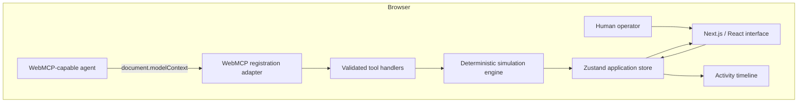
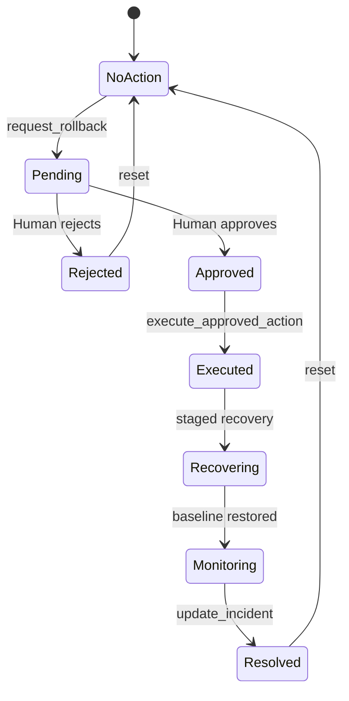

# Architecture

This document describes the runtime architecture, state boundaries, authorization protocol, and operational characteristics of WebOps Commander.

## Design principles

WebOps Commander is designed around four constraints:

1. WebMCP is the browser-to-agent capability boundary.
2. The operator interface and agent tools share one state model.
3. Consequential actions require visible human authorization.
4. The demonstration remains deterministic, testable, and immediately resettable.

## System context

The application runs entirely in the browser after its assets load. It has no API server, database, hidden agent service, or second incident model. WebMCP handlers and React components operate on the same browser-owned state.

## Component boundaries

### Domain model

`lib/domain/types.ts` defines incidents, services, telemetry, logs, traces, deployments, runbooks, actions, lifecycle states, and audit events. These types form the shared vocabulary used by the simulator, store, WebMCP handlers, and interface.

### Scenario fixtures

`lib/simulation/scenario.ts` contains the immutable `INC-2048` scenario. Its telemetry and evidence are intentionally correlated:

- `checkout-service` version `v2.18.4` introduces stricter issuer validation;
- checkout errors and p95 latency increase immediately after deployment;
- a structured error log reports a token-issuer mismatch;
- a failing trace localizes the regression to `validatePaymentToken`;
- payment and inventory remain healthy;
- rollback to `v2.18.3` restores the baseline.

### Simulation engine

`lib/simulation/engine.ts` implements pure queries and guarded state transitions. The engine remains independent from React and WebMCP so its behavior can be tested directly.

Recovery advances through fixed stages:

| Stage           | Error rate | P95 latency |
| --------------- | ---------: | ----------: |
| Incident        |      18.4% |    4,700 ms |
| Rollback begins |      12.7% |    3,100 ms |
| Traffic shifts  |       7.1% |    1,800 ms |
| Stabilizing     |       2.2% |      890 ms |
| Monitoring      |       0.7% |      630 ms |

### Application state

`lib/store/use-commander-store.ts` is the single mutable source of truth. It owns:

- the active incident and service versions;
- current telemetry and recovery stage;
- pending action and authorization state;
- selected evidence and topology paths;
- WebMCP availability;
- the activity timeline;
- scheduled recovery timers.

Store actions enforce lifecycle guards even when invoked outside the visual controls. Reset cancels scheduled recovery work before restoring the initial scenario, preventing delayed state changes from a previous run.

### WebMCP boundary

The WebMCP implementation is intentionally thin:

| Module                           | Responsibility                                         |
| -------------------------------- | ------------------------------------------------------ |
| `lib/webmcp/tool-schemas.ts`     | Tool names and Zod input contracts                     |
| `lib/webmcp/tool-definitions.ts` | Descriptions, categories, annotations, and JSON Schema |
| `lib/webmcp/tool-handlers.ts`    | Runtime validation, execution, and audit summaries     |
| `lib/webmcp/register-tools.ts`   | Feature detection, registration, and cleanup           |
| `lib/webmcp/tool-results.ts`     | Stable success and error envelopes                     |

Registration uses an `AbortSignal` so tools are removed when the command center unmounts. The optional developer tester calls the same handler layer directly but is not presented as native WebMCP transport.

### Presentation

Next.js renders two routes:

- `/` provides the product explanation and entry point;
- `/commander` provides the operational workspace.

The command center composes telemetry, service topology, evidence, an operator prompt, the human approval dialog, the activity timeline, settings, developer tooling, and the resolved-state summary. Components use stable selectors against the shared store to avoid duplicated domain state.

## Authorization protocol

The protocol separates intent, authorization, and execution:

1. `simulate_rollback` predicts an outcome without mutation.
2. `request_rollback` creates a pending action but cannot execute it.
3. The operator reviews scope, versions, rationale, risk, and predicted recovery.
4. Only the human-facing dialog can approve or reject the request.
5. Approval changes the action to `APPROVED`; it does not run the rollback.
6. `execute_approved_action` must be called separately with the exact action ID.
7. The handler validates identity and authorization immediately before mutation.

Unknown, pending, rejected, and previously executed actions fail closed. Resolution is rejected until recovery reaches `MONITORING`.

## Trust boundaries

- Zod validates every tool input at runtime.
- Unknown services, metrics, versions, ranges, and action IDs return stable errors.
- Mutating tools are never annotated as read-only.
- Tool and UI actions pass through the same guarded transitions.
- Every invocation records its category, input summary, result, duration, and timestamp.
- Human approval and rejection are recorded alongside agent activity.
- All scenario data is synthetic and remains local to the browser.

## Accessibility and responsive behavior

The interface uses semantic landmarks, a skip link, visible focus treatment, labeled controls, Radix Dialog focus management, nonvisual chart context, and text-backed status indicators. Motion respects `prefers-reduced-motion`.

The layout is verified at 375, 768, 1024, and 1440 pixels. Dense grids collapse on smaller screens, the activity timeline moves below the main workspace, and dialogs remain operable without page-level horizontal overflow.

## Operational characteristics

| Concern        | Behavior                                                                  |
| -------------- | ------------------------------------------------------------------------- |
| Persistence    | In-memory; refresh or Reset Demo restores initial state                   |
| Network        | No runtime data requests after application assets load                    |
| Authentication | None; the project contains no real systems or customer data               |
| Compatibility  | Full operator UI remains available when WebMCP is unsupported             |
| Failure mode   | Invalid and unauthorized transitions return typed errors without mutation |
| Determinism    | Fixed fixtures, identifiers, timings, and recovery stages                 |

## Production considerations

A production implementation would replace the deterministic adapter with authenticated observability and deployment integrations. It would also require operator identity, role and environment policy, durable and tamper-evident audit storage, secret management, concurrency controls, idempotency, and safe degraded behavior. Those capabilities should sit behind the same human authorization boundary demonstrated here.
