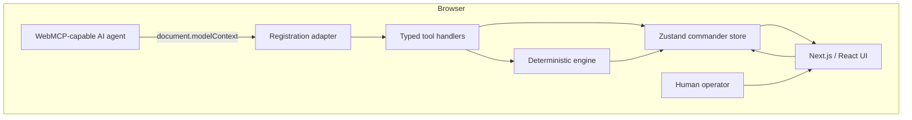
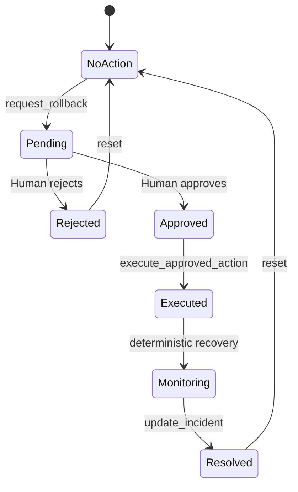

# WebOps Commander Architecture

## Design goals

WebOps Commander is small enough to understand during a hackathon review while proving a complete agent-native workflow. It optimizes for four properties: WebMCP is the real browser-to-agent boundary; the agent and UI share one state model; consequential actions need explicit visible authorization; every run is deterministic and instantly resettable.

## System overview

There is no server, database, hidden agent service, or duplicated incident model. The browser owns the complete demo. WebMCP exposes capabilities of the active application itself.

## Layers

### Domain and scenario

`lib/domain` defines incidents, services, metrics, logs, traces, deployments, runbooks, actions, lifecycle states, and audit events. `lib/simulation/scenario.ts` contains immutable fixture data for `INC-2048`. Metrics, logs, traces, deployments, dependencies, and runbooks correlate intentionally: the newest checkout deployment introduces issuer validation, matching an error log and failing trace span.

### Deterministic engine

`lib/simulation/engine.ts` implements pure queries and transitions. Recovery uses fixed stages:

| Stage           | Error rate | p95 latency |
| --------------- | ---------: | ----------: |
| Incident        |      18.4% |    4,700 ms |
| Rollback begins |      12.7% |    3,100 ms |
| Traffic shifts  |       7.1% |    1,800 ms |
| Stabilizing     |       2.2% |      890 ms |
| Monitoring      |       0.7% |      630 ms |

Pure functions are unit-tested independently from React and WebMCP.

### Client state

`lib/store/use-commander-store.ts` is the single mutable source of truth. It owns the incident, services, metrics, pending action, recovery step, selected evidence, WebMCP availability, and audit timeline. Store actions enforce approval and lifecycle guards even outside visual controls.

### WebMCP boundary

- `tool-schemas.ts` defines Zod input contracts and tool names.
- `tool-definitions.ts` supplies descriptions, categories, read-only metadata, and JSON Schema.
- `tool-handlers.ts` validates input and implements structured results against state.
- `register-tools.ts` feature-detects `document.modelContext`, registers tools, and attaches an `AbortSignal` for cleanup.
- `tool-results.ts` defines stable success and error envelopes.

This separation makes handlers directly testable without claiming that the developer tester is native WebMCP.

### Presentation

Next.js renders a landing page and `/commander`. The command center composes the incident header, explanatory KPIs, synchronized chart, service topology, evidence tabs, prompt, approval dialog, activity rail, settings dialog, responsive developer tester, and resolution view. Stable store selectors avoid render loops and preserve the hierarchy on tablet and mobile.

## Human approval protocol

`request_rollback` proposes but never executes. Approval happens only through the human-facing dialog. `execute_approved_action` is a separate WebMCP call and checks identity plus `APPROVED` status immediately before mutation. Duplicate execution and execution from `PENDING` or `REJECTED` fail closed.

## Trust boundaries

- Zod validates all tool inputs at runtime.
- Unknown services, metrics, versions, ranges, and action IDs produce stable codes.
- Mutating tools are not marked read-only.
- Results use `{ ok, data, meta }` or `{ ok: false, error }` envelopes.
- UI controls and tool calls use the same guarded transitions.
- The audit rail records category, status, duration, summarized input, and result.
- The scenario is synthetic; no production system is contacted.

## Accessibility and responsiveness

The app uses semantic landmarks, a skip link, focus-visible rings, labeled buttons, Radix Dialog focus management, chart context for nonvisual users, and color-plus-text statuses. Dense grids collapse at smaller widths, the activity rail becomes a normal section, dialogs fit narrow screens, and browser tests assert no horizontal overflow.

## Operational characteristics

- **Persistence:** in-memory by design; refresh or Reset Demo restores known state. Reset also cancels every scheduled recovery stage before replacing state, preventing delayed mutations after a mid-recovery reset.
- **Network:** none after application assets load.
- **Authentication:** none; the scenario is synthetic.
- **Fallback:** the dashboard works and reports unavailable when WebMCP is absent.
- **Failure:** invalid or unauthorized transitions return typed errors without mutation.

Production observability and deployment adapters could replace the deterministic adapter behind the same contracts. They are intentionally outside this hackathon scope so the WebMCP and approval model remain legible.
